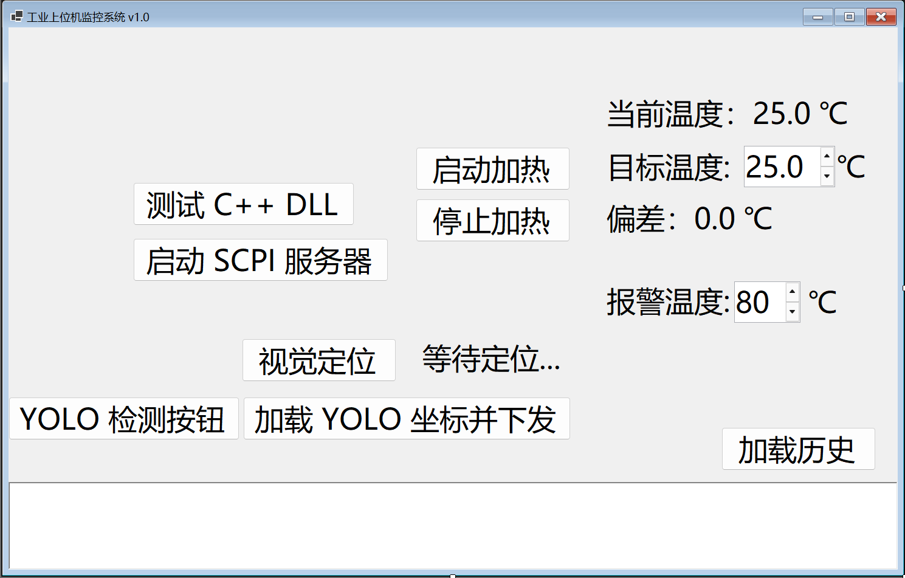

# 工控上位机监控系统

基于 C# WinForms 开发的工业上位机监控系统，集成 Modbus TCP 通信、SCPI 命令模拟、OpenCV 视觉定位、YOLO 目标检测和 WebAPI 接口，形成完整的“采集-控制-通信-展示”闭环。

## ✨ 功能特性

### 设备控制
- 实时温度监控与大字显示
- 目标温度设定与自动逼近控制
- 可配置超温报警阈值（界面动态调整）

### 通信协议
- **Modbus TCP 服务器**（端口 502）— 温度数据（寄存器 0-1）和视觉坐标（寄存器 2-5）对外暴露
- **SCPI 命令模拟器**（端口 5021）— 支持 `MEASure:VOLTage?`、`*IDN?` 等标准 SCPI 指令
- **TCP/IP 自定义协议** — 长度头 + 数据体粘包/拆包处理

### 视觉定位
- **OpenCV 模板匹配**：匹配度 > 0.8 返回像素坐标，自动写入 Modbus 寄存器
- **YOLO 目标检测**：支持预训练模型推理，输出检测结果（类别 + 坐标 + 置信度），结果保存为 JSON 文件

### 对外接口
- WebAPI：`GET /temperature` 返回 JSON 格式实时温度（含时间戳）
- WebAPI：`GET /yolo` 返回 YOLO 检测结果 JSON

### 数据持久化
- SQLite 历史数据存储与最近 20 条记录查询
- 线程安全日志系统（界面显示 + 文件同步写入），支持日志自动轮转

### 部署特性
- 支持通过 `appsettings.json` 配置文件修改端口和阈值，无需重新编译
- 全局异常捕获，程序不会因未处理异常而直接崩溃
- 项目已发布可运行版本，支持直接下载使用

## 🛠️ 技术栈

| 类别 | 技术 |
| :--- | :--- |
| 语言与框架 | C#、.NET 8、WinForms |
| 通信协议 | TCP/IP、Modbus TCP、SCPI |
| 数据库 | SQLite |
| 计算机视觉 | OpenCVSharp、YOLO |
| WebAPI | ASP.NET Core Minimal API |
| 混合编程 | C++ DLL（P/Invoke） |
| 版本控制 | Git、GitHub |

## 📁 项目结构

```
IndustrialControlSystem/
├── Form1.cs                 # 主窗体
├── Heater.cs               # 温度模拟与控制
├── ModbusServer.cs         # Modbus TCP 服务器
├── ScpiServer.cs           # SCPI 命令模拟器
├── DbHelper.cs             # SQLite 数据操作
├── Logger.cs               # 文件日志
├── MathLib/                # C++ DLL 源码
├── appsettings.json        # 配置文件
└── bin/Release/            # 可执行文件
```

## 🚀 快速开始

### 运行环境
- Windows 10/11
- .NET 8 桌面运行时（如果没有安装，程序会提示安装）

### 下载运行
1. 访问 [Releases](https://github.com/yuebanshengii/TempMonitorUI/releases) 页面
2. 下载最新版本的 `TempMonitorUI_v1.0.zip`
3. 解压后双击 `TempMonitorUI.exe` 即可运行

### 配置修改
运行前可以通过修改 `appsettings.json` 调整参数：

```json
{
  "Modbus": { "Port": 502 },
  "WebApi": { "Port": 5000 },
  "Scpi": { "Port": 5021 },
  "Threshold": 80
}
```

## 📸 功能演示



## 📄 许可证

本项目仅供学习与面试作品展示使用。
